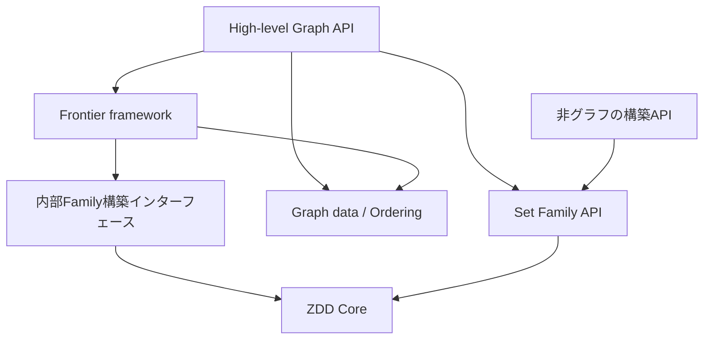

# アーキテクチャ設計

関連: [仕様](specification.md)、[設計判断](decisions.md)、[Frontier設計](frontier.md)。

## 1. レイヤーと依存方向



矢印は依存方向を表す。FamilyからGraph・Frontierへ依存してはいけない。Graph APIはFrontierを使って構築し、Familyを使って後処理する。FrontierProblemのStateにZDDのNodeIdを持たせることは要求しない。

単一公開crate内に`family`、`zdd`、`graph`、`frontier`、`problems`を置く。coreから上位へ依存させない。将来の`io`や`optimization`は必要になった時点で追加する。v1からpublic backend traitを設けない。

## 2. 論理モデルと所有権

```text
FamilySpace ── 所有 ──> Arc<Manager>
SetFamily   ── 所有 ──> Arc<Manager> + RootHandle
Manager     ── 所有 ──> immutable Universe/Order + 可変Store
GraphSpace  ── 所有 ──> Arc<GraphData> + FamilySpace + Edge/Variable mapping
EdgeFamily  ── 所有 ──> Arc<GraphData> + SetFamily + mapping
Solutions   ── 保持 ──> 対象Family + traversal stack
CountIndex  ── 所有 ──> 対象順序/対応 + query用DAG + 部分解数
```

Familyの意味は不変。managerは新しいノードを追加できる。同じspaceの二つのFamilyは共有ノードを直接参照し、新Family生成のために全ノードを別storeへ移さない。

v1のgeneric Familyは「グラフに依存しない」という意味であり、ZDDノードをユーザーの任意型でgenericにすることを意味しない。Familyの要素はVariableId、グラフwrapperの要素はEdgeIdとする。文字列・ジョブ等の外部データはIDとの対応表で扱える。typed label adapterの汎用化は後から追加可能。

spaceの同一性はmanagerの所有インスタンスに結び付ける。別spaceの同じ数値ID・同じ変数数だけでは互換と見なさない。内部NodeIdをpublicに渡して複数manager間で混用できる設計にしない。

## 3. backend境界

エンジン選択は未決。OxiDD再利用と小さな専用coreを比較する。必要な内部能力は次の範囲とする。

- 順序付きのZDDノード作成とcanonical rootの保持。
- ノードの安全な読み取り、子の取得。
- 基本集合演算の実行または実装に必要なアクセス。
- rootの寿命・GCとの協調。
- 資源制限と統計。
- 同じmanagerへ複数のFrontier結果を登録すること。

publicなFamily APIにOxiDDの型、pointer/index幅、cache型、GC方式を露出させない。OxiDDを使う場合、ZERO、unit、powersetの意味が本仕様と一致するようadapterを検証する。基盤のGC/同期規則を無視した独自IDの長期保持や二重lockを行わない。

以下のarena・table・同期の詳細は**専用coreを採用した場合の初期設計**である。

## 4. ノード・ID・不変条件

- 非terminalノードは連続arenaで管理。
- 内部NodeIdはu32を初期候補とし、0をZERO、1をONEに予約。
- 非terminalは`Level(u32), lo: NodeId, hi: NodeId`。素直な配置で12 bytesを目標とするが、ABIとして保証しない。
- 配列アクセスとcapacity計算ではusizeを使用。外部サイズからの変換はchecked。
- NodeIdにgenerationは付けず、構築中にslotを再利用しない。
- VariableIdは要素の識別、Levelは順序内の位置。nodeにはLevelを格納。
- EdgeIdは入力時の辺の識別を維持し、orderingに合わせてEdgeIdそのものを振り直さない。

### 不変条件

1. ZEROの意味は空Family、ONEの意味は空解一つ。
2. すべての子IDが存在する。
3. 非terminalの子のlevelは親より大きい。
4. すべての非terminalで`hi != ZERO`。
5. 同じ`(level, lo, hi)`はmanager内に一つ。
6. arenaでは子を先に作り、親を後に追加する。ノード内容は公開後に変更しない。
7. RootHandleは所属managerとともに保持する。
8. 演算中の失敗後も1〜7を維持する。

一意性は同じuniverse・順序内で成立する。別managerのroot番号を意味論的な等価判定に利用しない。

## 5. reductionとUnique Table

内部`mk_node(level, lo, hi)`だけがノードを登録する。

1. 子ID・順序の不変条件を確認。
2. `hi == ZERO`なら`lo`を返す。
3. Unique Tableを検索し、既存ノードがあればそのIDを返す。
4. 新規ノードが必要な場合だけ上限・予約領域を確認。
5. arenaとtableに登録する。

ZDDでは`lo == hi`だけを理由にノードを除去しない。`node(v, ONE, ONE)`は`{∅,{v}}`を表す。

Unique Tableはmanagerの寿命を通じて維持する。`hashbrown::HashTable<NodeId>`でarena上の完全なノードkeyを比較し、keyの二重保持を避ける案を初期候補にする。実装の単純なHashMap版を性能比較用baselineにしてよい。

randomized hasherをbaselineとし、整数keyのFxHash等は実測して判断する。hash衝突時は必ず完全一致を確認。tableの走査順にFamilyの列挙順や意味を依存させない。

専用coreにonline GCがない間はweak referenceは不要。GC導入時はroot、Unique Table、Computed Table、cursor、query indexの寿命をまとめて再設計する。

## 6. Family演算

### apply

union/intersection/difference/symmetric differenceは、共通の反復的な二項apply基盤を利用する。terminal則は演算ごとに定義し、小規模全探索で検証する。

片方が現在levelのノードを持たない場合、その側の分解は`(lo=元ノード, hi=ZERO)`。BDDのdon't-care分解を流用しない。

演算stackはheap上の明示的なframe列とし、子の結果が揃ってからmk_nodeする。再帰深度を変数数に比例させない。

### filter

inclusionは対象variableを残す。対象ノードでhiを選択した後にvariableを再構成する。exclusionはlo側を選択する。subsets_of/supersets_ofは対象集合を正規化し、要素条件に基づくDPを用いる。

任意の`Fn(solution)->bool`をsymbolicに実行するAPIをv1に設けない。任意predicateはiterator上で使う。

### cardinality

exactlyのmemo keyは`(NodeId, remaining_count)`。lo側は個数を変えず、hi側は1減らす。ONEで残り0の場合だけ受理する。rangeは残りの許容区間を持つ同様のDP。

ノード以下のmin/max cardinalityを別のDPで求め、範囲が不可能ならZERO、全解が条件内なら元ノードを返す最適化を追加できる。最適化前後の集合一致を検証する。

ノードごとに複数の残り個数が到達し得るため、元のノード数だけに対する線形時間を保証しない。

## 7. cacheとquery index

| 領域 | key/内容 | 寿命・方針 |
|---|---|---|
| Unique Table | `(level, lo, hi)` | manager単位。ノード一意性に必須 |
| operation memo | 演算種別・operand・parameter | 一操作中に保持。上限超過は失敗 |
| shared computed cache | 基本演算とparameter、result | manager単位、容量制限付き。eviction可能 |
| min/max cardinality table | NodeIdごとの境界 | query/scratch単位。効果を測って再利用 |
| CountIndex | query用DAGとBigUint部分解数 | 明示所有。managerへ永久保存しない |
| optimization index | root・重み表に対応した最適値 | v1.x。重み表をkeyの一部として扱う |

演算間cacheのmiss・evictionは結果を変えない。演算中のmemoを全消去して再計算を無制限に繰り返す挙動をdefaultにしない。操作中memoの再利用回数と上限を統計へ出す。

交換可能な二項演算はoperand順を正規化できるが、difference等はしない。別managerのIDを同じcache keyへ混ぜない。自作coreではID再利用・reorderingがないため既存ノードのcacheは安定。既存backendを使う場合はGCイベントとcacheの規則に従う。

### CountIndex

初期設計では到達可能部分DAGをquery用のcompactなlocal indexへ写し、部分解数と必要な変数対応を所有する。これによりsampling中のRNG呼び出しや将来のrank/unrankでmanagerのlockを保持せず、GCに依存する生NodeIdも外へ持ち出さない。

このsnapshotはquery単位の追加`O(N)`領域であり、Family演算ごとのDAGコピーではない。ノードとBigUintの両方のサイズをQueryLimits・統計へ含める。BigUintだけを返すcountでは必ずしもsnapshot全体を残す必要はない。

CountIndexは自分が表すFamilyにのみ適用する。別rootへindexをそのまま使い回すAPIは提供しない。index内の順序は元Familyの変数順序を維持する。

### Countと一様samplingのDP

部分解数は`C(ZERO)=0`、`C(ONE)=1`、`C(n)=C(lo)+C(hi)`。BigUintの加算コストと保持bit数を含める必要があり、単に定数時間加算として扱わない。省略されたvariableに対する係数は不要。

samplingは`0 <= r < C(root)`の一様なBigUint整数を生成して、次の順にたどる方式を初期案とする。

1. rがC(lo)未満ならloへ進む。
2. それ以外なら現在variableを選択し、`r -= C(lo)`としてhiへ進む。
3. ONEに達したら現在解を返す。

この方式は将来のunrankと共通化できる。rの生成は必要bit数の乱数から範囲外を棄却するrejection samplingを使う。剰余だけで範囲へ押し込まない。0解はNone、1解なら乱数を消費しなくてもよい。RNG/version間で乱数消費回数まで固定する契約は設けない。

将来のrankは、解のビット列に沿ってhiへ進むたびC(lo)を加算する。省略variableを選択している入力は非メンバー。入力集合の正規化とmembershipを確認し、同じvariable orderのiteratorに一致させる。

## 8. 同期と再入

自作coreはArcでmanagerを所有し、演算単位の粗粒度read/write同期を初期案とする。具体的なlock実装はbackend選定時に確定する。

- Family演算はwrite側を一度取得して内部計算を行う。ノードごとのlockは禁止。
- count等の内部DPはread側で実行できる。query用にコピーした後はguardを解放する。
- iteratorは次の解を求める内部区間だけguardを使い、`next()`から戻る前に解放する。
- visitorはユーザーcallbackを呼ぶ前にguardを解放する。
- RNGはCountIndex上で呼び出す。manager guard下で呼ばない。
- v1.xのコストclosureは重み表作成時に呼び、guard下で呼ばない。
- FrontierのユーザーState遷移・Hash/Eq・正規化はZDD managerを書き込みlockしたまま実行しない。

同一managerのwriteは直列化される。独立spaceは独立に利用できる。並行利用可能であることと、一操作の並列高速化を区別する。frontier traitにv1からSend/Syncを強制せず、将来の並列入口にだけ追加boundを置く。

## 9. メモリ・失敗・compaction

自作coreのv1では、不要ノードのonline回収を行わない。Familyがdropされても、同じmanagerが生きていればarenaは減らない。最後の所有者がdropしたときに一括解放する。

明示compactionは複数rootをまとめて新spaceへコピーし、到達不能ノードを取り除く。root間の共有、universe、variable order、Graph mappingを維持する。元spaceを破壊せず、旧Family・iteratorは引き続き有効。

compactionには旧・新DAGとID変換表が同時に必要になる。旧Familyを保持したままでは旧メモリは解放されない。上限・ピーク値にこの一時領域を含める。

mk_nodeでは必要な容量を先に確保し、有効なノードとtableの登録を整合的に行う。操作失敗時に公開rootは変更しない。ただし、すでに作られた有効な一時ノード・cacheが残ることは許容する。全操作のallocationをロールバックする強いtransaction保証はv1では要求しない。

## 10. 性能設計の原則

- ノード・State・各種indexで、データ本体を一度だけ所有する。
- StateにGraphや大きな不変設定をcloneして持たせない。
- 可変長bufferは容量を再利用し、新規Stateを保存する場合の所有allocationと作業copyを区別する。
- hashing、canonicalization、node locality、cache localityを個別に測る。
- 外部の型安全なIDと内部のcompactなindexを区別する。
- apply、列挙、DP、compactionは深い再帰に依存しない。
- 短い便利APIでも計算量・追加領域をドキュメント化する。
- unsafeはv1自前コードでは使わない方針。依存crateの内部unsafeとは区別する。

実装前に固定するのは意味論・所有権境界・資源制限であり、hasher、node layout、cache置換規則等は検証結果に応じて変更する。

## 11. 将来の最適化・weighted拡張

初期v1.xの加法コストは`cost(S)=sum(w(v), v in S)`。通常のZDDを変更せず、次のDPで最小解を得る。

- `M(ZERO)=到達不能`、`M(ONE)=0`。
- `M(n)=min(M(lo), w(v)+M(hi))`。到達不能な候補は比較から除く。
- 選択した分岐を記録し、rootから解を復元する。
- 同値ならloを優先し、iterator/rankの先頭側を選ぶ。

maxも同様。有限DAGなので負のコストを許せる。到達不能に最大整数等の番兵を使わない。初期案ではi64の要素コストをi128へ変換してchecked加算し、数値仕様の変更が容易な小さな内部境界に閉じる。

ユーザーのコストclosureはsupportにある要素につき一度評価してimmutableな重み表を作る。closureの実行中はmanager lockを持たない。DP cacheをNodeIdだけで共有せず、rootと重み表の組に結び付ける。

top-kは単一最適解のDPだけでは完結しない。最適suffix値を下界として利用する優先度付き探索やDAG上のk-best方式を別途比較する。同点・解の一意性・遅延出力・候補queueのメモリを仕様化し、計算量を未検証のまま約束しない。

weighted samplingでは、例えば`P(S) ∝ product(q(v), v in S)`という非負の選択要素重みを採用した場合、`Z(ZERO)=0`、`Z(ONE)=1`、`Z(n)=Z(lo)+q(v)Z(hi)`で質量を求められる。全質量0、負値、NaN等をどう扱うかはAPI追加前に決める。

独立Bernoulliの条件付き分布では、非選択要素にも係数があり、省略variable分の重みも扱う必要がある。上の積モデルと同じものとして実装しない。加法的最適化コストとも区別する。

semiring abstractionは複数の具体的DPが揃った後で共通部分を評価する。最初から全Nodeをgeneric weight型にしない。任意の解重みを持つweighted ZDDは、通常ZDDへの数値評価とは別の表現設計である。
